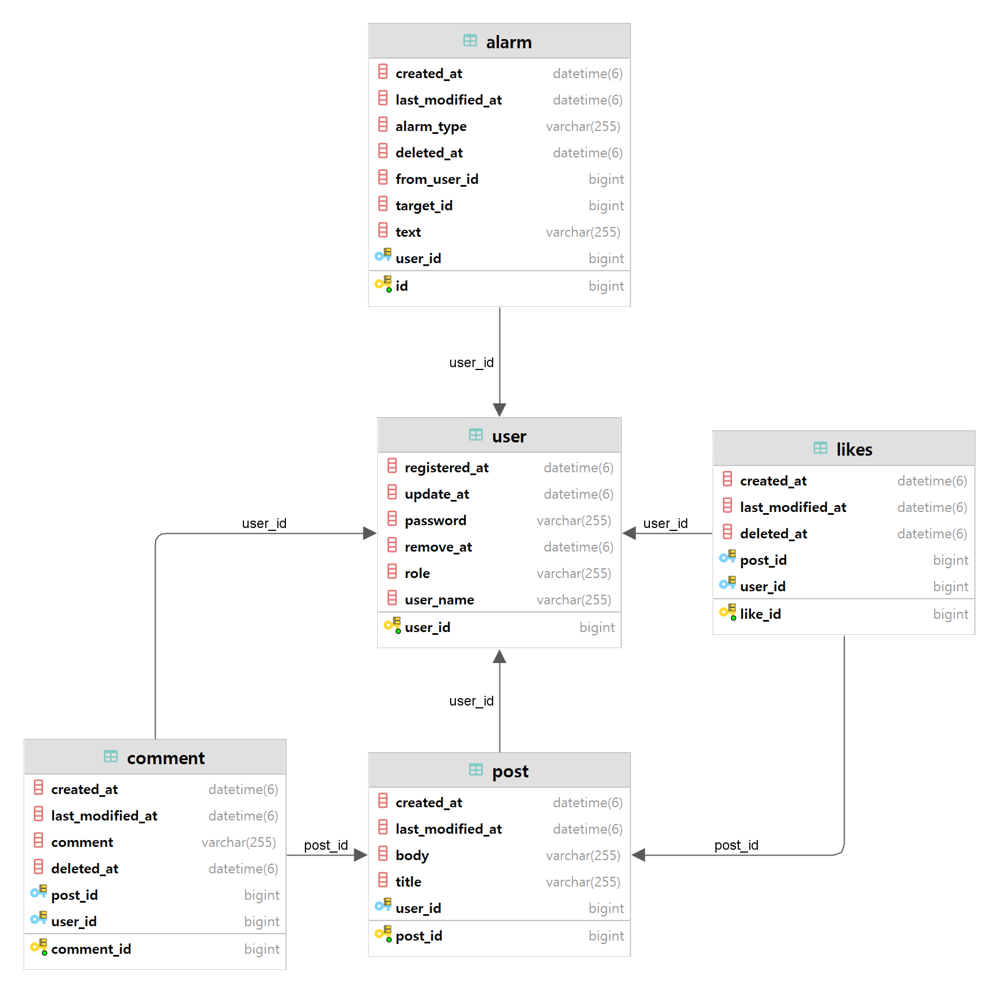

<div align="center">
    
</div>
<div align="center">
    <h1>📢 Tech Stack </h1>
</div>
<div align="center">
    
    <br>
    
    
    <br>
    
    <br>
    
    
</div>
<br>

# Mutsa Final Project 🌈 멋사스네스(MustsaSNS)

## 📚 프로젝트 개요
1️⃣ 로그인   
2️⃣ 회원가입   
3️⃣ 글 작성/수정/삭제/리스트    
4️⃣ 댓글 작성/수정/삭제/리스트    
5️⃣ 좋아요    
6️⃣ 알람    
7️⃣ 마이피드    

1️⃣ ~ 7️⃣ 기능들을 사용하여 회원들끼리 소통하는 SNS 애플리케이션

## 📃 개발환경
- 에디터 : Intellij Ultimate
- 개발 툴 : SpringBoot 2.7.5
- 자바 : JAVA 11
- 빌드 : Gradle 6.8
- 서버 : AWS EC2
- 배포 : Docker
- 데이터베이스 : MySql 8.0
- 필수 라이브러리 : SpringBoot Web, MySQL, Spring Data JPA, Lombok, Spring Security

## 🛠 기능
- Swagger
- AWS EC2에 Docker 배포
- Gitlab CI & Crontab CD

## 📢 Swagger
http://ec2-52-79-78-160.ap-northeast-2.compute.amazonaws.com:8080/swagger-ui/

## 📊 ERD


## 📊 아키텍쳐


## 📃 EndPoint
> 회원가입
`POST /api/v1/users/join`    

> 로그인
`POST /api/v1/users/login`    

> 포스트 전체 조회
`GET /api/v1/posts`    

> 포스트 1개 조회
`GET api/v1/posts/{postId}`    

> 포스트 등록
`POST api/v1/posts`    

> 포스트 수정
`PUT api/v1/posts/{postId}`    

> 포스트 삭제
`DELETE /api/v1/posts/{postId}`    

> 댓글 등록
`POST /api/v1/posts/{postId}/comments`    

> 댓글 수정
`PUT /api/v1/posts/{postId}/comments/{id}`    

> 댓글 삭제
`DELETE /api/v1/posts/{postId}/comments/{id}`    

> 좋아요 누르기    
`POST /api/v1/posts/{postId}/likes`    

> 좋아요 개수
`GET /api/v1/posts/{postId}/likes`    

> 받은 알람 조회
`GET /api/v1/alarms`


## 📃 기능구현
* 모든 기능의 응답값은 Response로 감싸서 resultCode와 result로 나누어 보여준다.
```json
{
  "resultCode": //... ,
  "result": {
        // ...
  }
}
```

---

### 회원가입, 로그인 (url : `/api/v1/users`)
> **회원가입 `POST /join`**    
회원 가입 시 password는 encoding하여 암호화된 상태로 DB에 저장한다.
* Request
```json
{
  "userName": "user1",
  "password": "user1234"
}
```
* Response
```json
{
  "resultCode": "SUCCESS",
  "result": {
    "userId": 1,
    "userName": "user1"
  }
}
```
> **로그인 `POST /login`**    
Request로 넘어 온 정보와 DB에 저장된 정보가 같다면 jwt 토큰을 발급해줌

* Request
```json
{
	"userName" : "user1",
	"password" : "user1234"
}
```
* Response
```json
{
  "resultCode": "SUCCESS",
  "result": {
    "jwt": "eyJhbGciOiJIU",
  }
}
```

---

### 포스트 등록/수정/삭제/조회 (url : `/api/v1/posts`)
* 포스트 등록 : 회원만 가능
* 포스트 수정/삭제 : 포스트를 등록한 회원만 가능
* 포스트 리스트/상세 조회 : 회원/비회원 모두 가능

> **포스트 등록 `POST ""`**

* Request
```json
{
  "title": "title1",
  "body": "body1"
}
```
* Response
```json
{
	"resultCode":"SUCCESS",
	"result":{
		"message":"포스트 등록 완료",
		"postId":0
	}
}
```

> **포스트 수정 `PUT /{postId}`**

* Response
```json
{
	"title" : "modified title",
	"body" : "modified body"
}
```
* Request
```json
{
	"resultCode":"SUCCESS",
	"result":{
		"message":"포스트 수정 완료",
		"postId":0
	}
}
```

> **포스트 삭제 `DELETE /{postId}`**

* Response
```json
{
	"resultCode":"SUCCESS",
	"result":{
		"message":"포스트 수정 완료",
		"postId":0
	}
}
```

> **포스트 전체 조회 `GET ""`**    
Pageable ((최신순, 20개씩 표시))
* Response
```json
{
    "resultCode": "SUCCESS",
    "result": {
        "content": [
            {
                "id": 10,
                "title": "title1",
                "body": "body1",
                "userName": "userName1",
                "createdAt": "2022/12/22 10:43:25",
                "lastModifiedAt": "2022/12/22 10:43:25"
            },
            {
                "id": 9,
                "title": "title2",
                "body": "body2",
                "userName": "userName2",
                "createdAt": "2022/12/22 10:42:44",
                "lastModifiedAt": "2022/12/22 10:42:44"
            },
            // ...
        ],
        "pageable": "INSTANCE",
        "last": true,
        "totalPages": 1,
        "totalElements": 4,
        "size": 4,
        "number": 0,
        "sort": {
            "empty": true,
            "sorted": false,
            "unsorted": true
        },
        "first": true,
        "numberOfElements": 4,
        "empty": false
    }
}
```

> **포스트 1개 조회 `GET /{postId}`**

* Response
```json
{
	"resultCode":"SUCCESS",
	"result":{
		"id" : 1,
		"title" : "title1",
		"body" : "body",
		"userName" : "user1",
		"createdAt" : yyyy-mm-dd hh:mm:ss,
		"lastModifiedAt" : yyyy-mm-dd hh:mm:ss
	}
}
```

---

### 댓글 등록/수정/삭제/조회 (url : `/api/v1/posts`)
* 댓글 작성 : 회원만 가능
* 댓글 수정/삭제 : 댓글을 작성한 회원만 가능
* 댓글 조회 : 회원/비회원 모두 가능(token 없이 가능)

> **댓글 등록 `POST /{postId}/comments`**

* Request
```json
{
	"comment" : "comment test4"
}
```
* Response
```json
{
	"resultCode": "SUCCESS",
	"result":{
		"id": 4,
		"comment": "comment test4",
		"userName": "test",
		"postId": 2,
		"createdAt": "2022-12-20T16:15:04.270741"
	}
}
```

> **댓글 수정 `PUT /{postId}/comments/{id}`**

* Request
```json
{
	"comment" : "modify comment"
}
```
* Response
```json
{
	"comment" : "modify comment"
}
```

> **댓글 삭제 `DELETE /{postId}/comments/{id}`**

* Response
```json
{
	"resultCode": "SUCCESS",
    "result":{
                "message": "댓글 삭제 완료",
                "id": 4
            }
}
```

---


### 좋아요 누르기/좋아요 조회 (url : `/api/v1/posts`)
* like를 한 번 누를때 마다 row가 1개씩 추가되는 방식
* soft delete를 사용하여 row가 삭제되지 않고 deletedAt에 날짜와 시간이 저장되는 방식

> **좋아요 누르기 `POST /{postId}/likes`**    
like를 한번 더 누르면 좋아요 취소

* Request
```json
{
    "resultCode":"SUCCESS",
    "result": "좋아요를 눌렀습니다."
}
```

> 좋아요 조회(개수) `GET /{postId}/likes`

* Response
```json
{
    "resultCode":"SUCCESS",
    "result": 0
}
```

---


### 알람 (url : `/api/v1/alarms`)
* Pageable (최신순, 20개씩 표시)

> **알람 리스트 `GET ""`**    
Pageable 설정 내용은 보이지 않고, content에 감싸져 보여주기

* Response
```json
{
    "resultCode":"SUCCESS",
    "result": {
        "content":
        [
            {
                "id": 1,
                "alarmType": "NEW_LIKE_ON_POST",
                "fromUserId": 1,
                "targetId": 1,
                "text": "new like!",
                "createdAt": "2022-12-25T14:53:28.209+00:00"
            }
        ]
    }
}
```

---

### 마이 피드 (url : `/api/v1/posts`)
* 로그인 된 유저만의 피드목록을 필터링하는 기능
* Pageable

> **마이 피드 조회 `GET /my`**

* Response
```json
{
  "resultCode": "SUCCESS",
  "result":{
    "content":
        [
            {
            "id": 4,
            "title": "test",
            "body": "body",
            "userName": "test",
            "createdAt": "2022-12-16T16:50:37.515952"
            }
        ],
	"pageable":
        {
            "sort":{"empty": true, "sorted": false, "unsorted": true }, "offset": 0,…},
            "last": true,
            "totalPages": 1,
            "totalElements": 1,
            "size": 20,
            "number": 0,
            "sort":{
            "empty": true,
            "sorted": false,
            "unsorted": true
        },
    "numberOfElements": 1,
    "first": true,
    "empty": false
}
```


