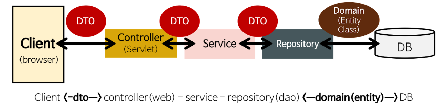
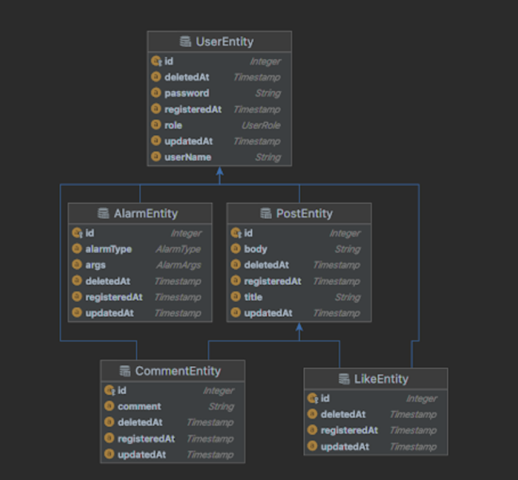

# Mutsa Final Project
> **멋사스네스(MutsaSNS) API 구현** <br>
> 멋쟁이사자처럼 백엔드 스쿨 2기 학생들의 학습 내용 정리를 위한 프로젝트

## 개발환경
- 에디터 : Intellij Ultimate
- 개발 툴 : SpringBoot 2.7.5
- 자바 : JAVA 11
- 빌드 : Gradle 6.8
- 서버 : AWS EC2
- 배포 : Docker
- 데이터베이스 : MySql 8.0
- 필수 라이브러리 : SpringBoot Web, MySQL, Spring Data JPA, Lombok, Spring Security

## 기능
- 회원가입
- Swagger
- AWS EC2에 Docker 배포
- Gitlab CI & Crontab CD
- 로그인
- 포스트 작성, 수정, 삭제, 리스트

## Architecture(아키텍처)


## ERD


---

## 기능구현
### 회원가입 (url : `/users`)
**POST `/join`**
> 입력폼으로 받아온 정보를 DB에 저장   
> 테스트 2가지 (회원가입 성공,실패(중복id))
* 입력폼
```json
{
  "userName" : "user1",
  "password" : "user1234",
  "email" : "user1@abc.com"
}
```
* 리턴폼
```json
{
  "resultCode": "SUCCESS",
  "result": {
    "userId": 1,
    "userName": "user1"
  }
}
```
**POST `/login`**
> JWT를 사용하여 로그인 시 DB의 정보가 맞다면 토큰을 발급해줌    
> 테스트 3가지 (로그인 성공, 실패(id,pw오류))
* 입력폼
```json
{
	"userName" : "user1",
	"password" : "user1234"
}
```
* 리턴폼
```json
{
    "jwt": "eyJhbGciOiJIU"
}
```